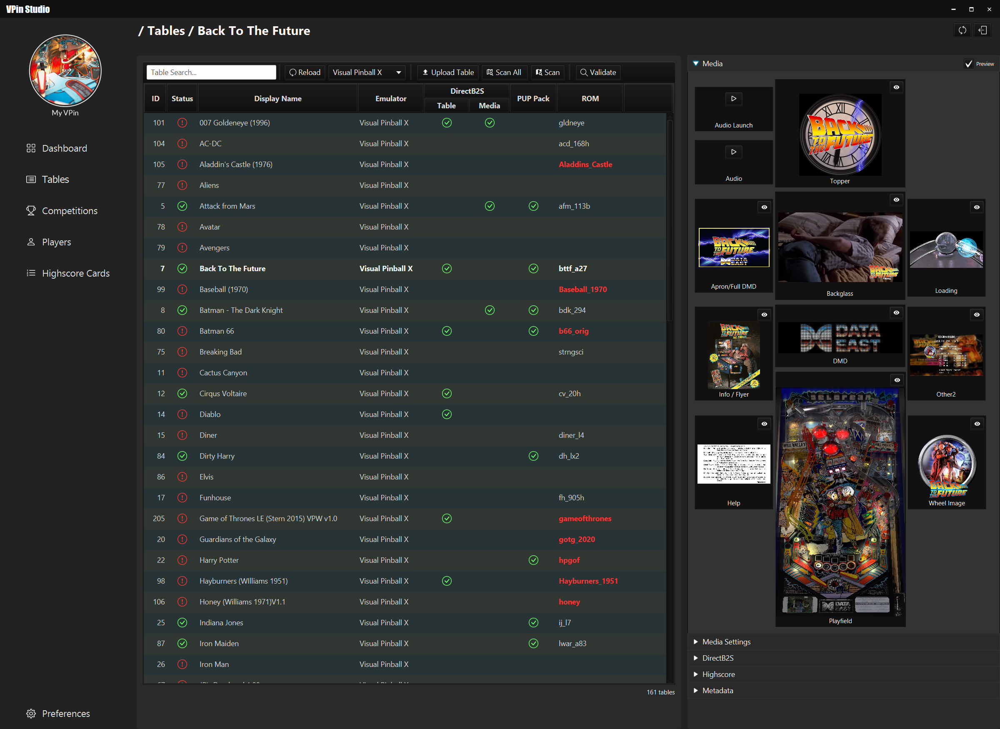
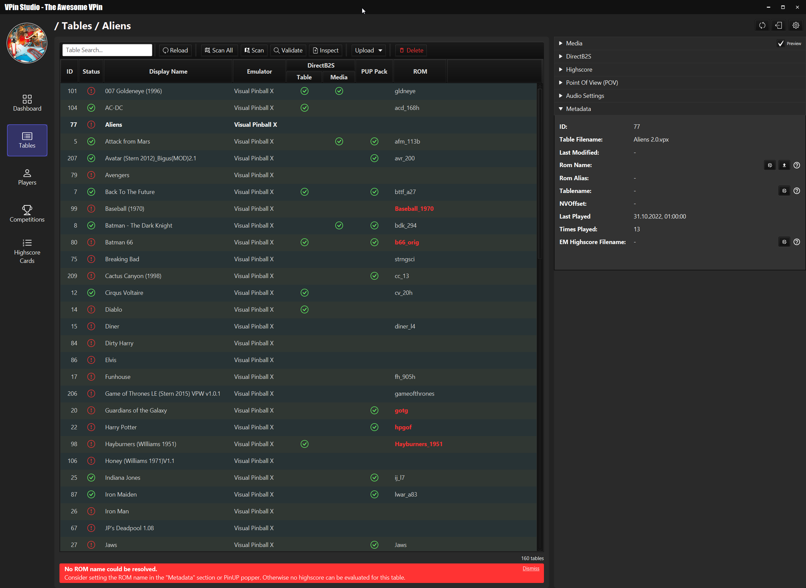

# VPin Studio

The VPin Studio is a util to manage VPin users, tables, competitions and highscores.
It depends on PinUP Popper and gives the user an overview about installed tables
and their media configuration.

## Installation

Download the latest installer from the [releases section](https://github.com/syd711/vpin-studio/releases). 

In general, the VPin Studio has a client/server architecture,
supporting the configuration of multiple VPins with one client.
That's why every release comes with two different installers:
- Full Installer: this installer must always be installed on the actual VPin and contains the server and the client UI.
- Client Installer: this installer only contains the UI client which let's you connect from any other Windows PC to your VPin.

## Sample Screenshots

A sample log generated from on the VPin bot:
 
_Discord Integration_

 
_Table Overview_

 
_Validation Issue Example_

## Third Party Licenses and Resources

For license texts have a look at [Third-Party Libraries](./documentation/third-party-licenses/)

### Icons
<a href="https://www.flaticon.com/free-icons/trophy" title="trophy icons">Trophy icons created by Freepik - Flaticon</a> 
<a href="https://www.flaticon.com/free-icons/medal" title="medal icons">Medal icons created by Freepik - Flaticon</a> 

### Fonts
Fonts: https://www.1001fonts.com/digital-7-font.html#license

### 7zip
https://7-zip.org/

### Sounds 
Sound Effect by <a href="https://pixabay.com/users/edr-1177074/?utm_source=link-attribution&amp;utm_medium=referral&amp;utm_campaign=music&amp;utm_content=8325">EdR</a> from <a href="https://pixabay.com//?utm_source=link-attribution&amp;utm_medium=referral&amp;utm_campaign=music&amp;utm_content=8325">Pixabay</a>

Sound Effect from <a href="https://pixabay.com/sound-effects/?utm_source=link-attribution&amp;utm_medium=referral&amp;utm_campaign=music&amp;utm_content=92097">Pixabay</a>
