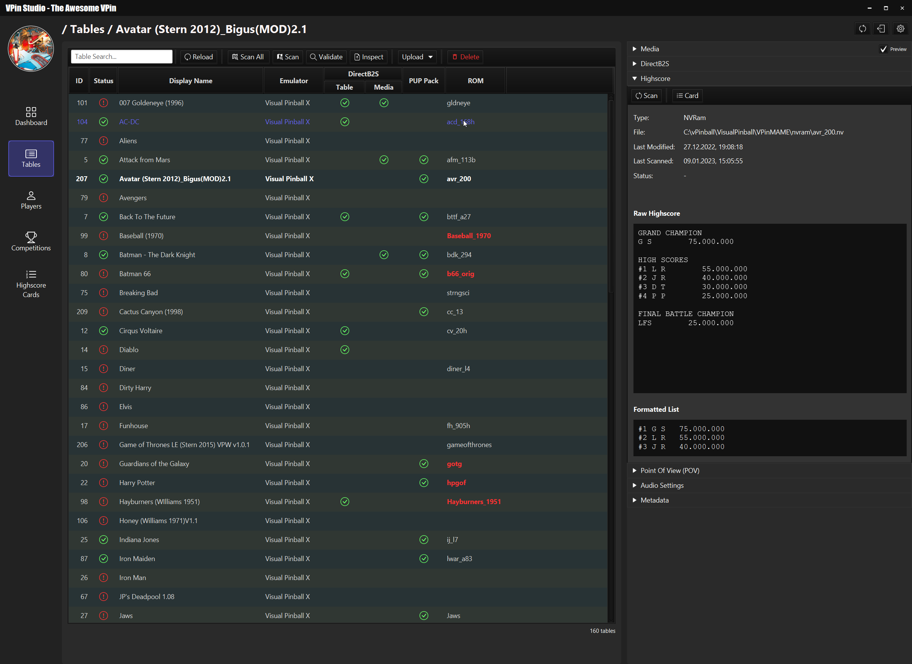
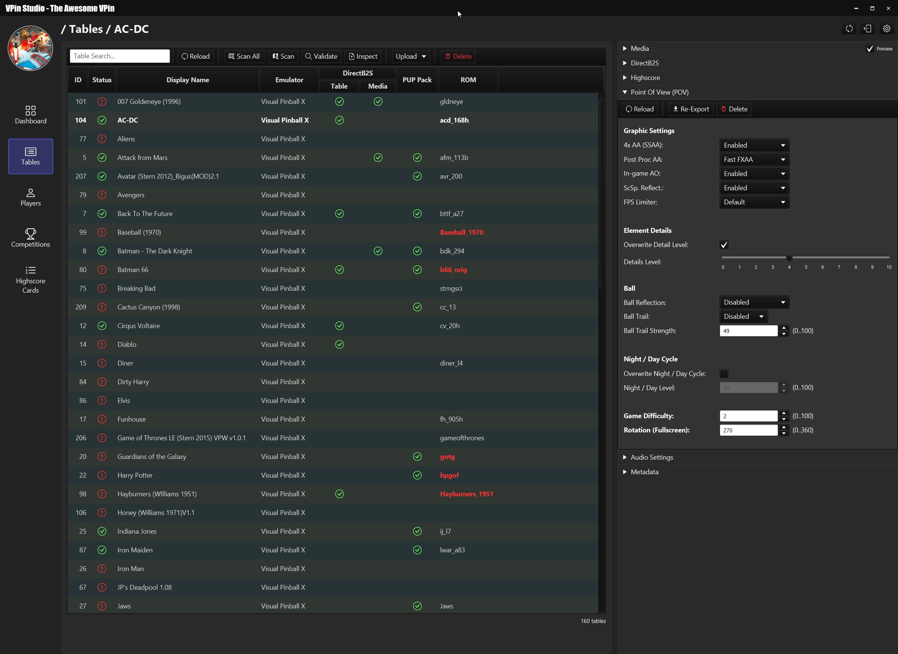
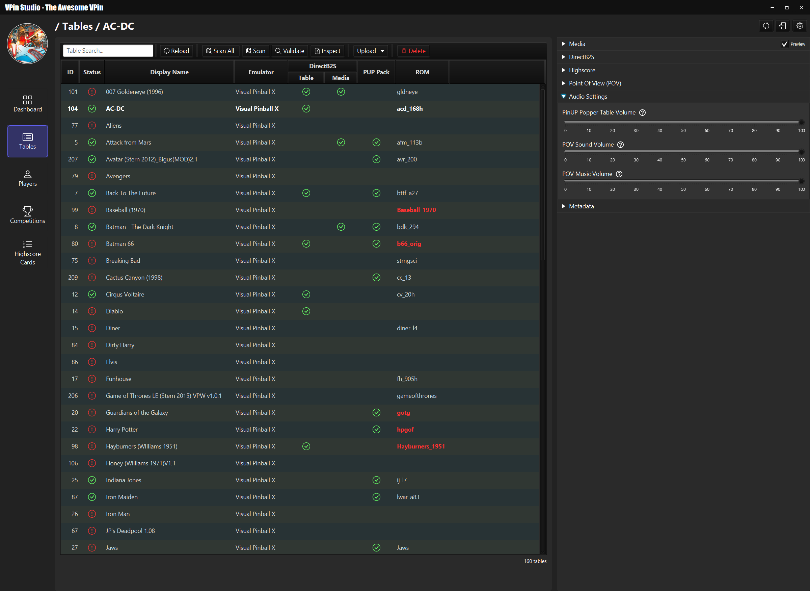
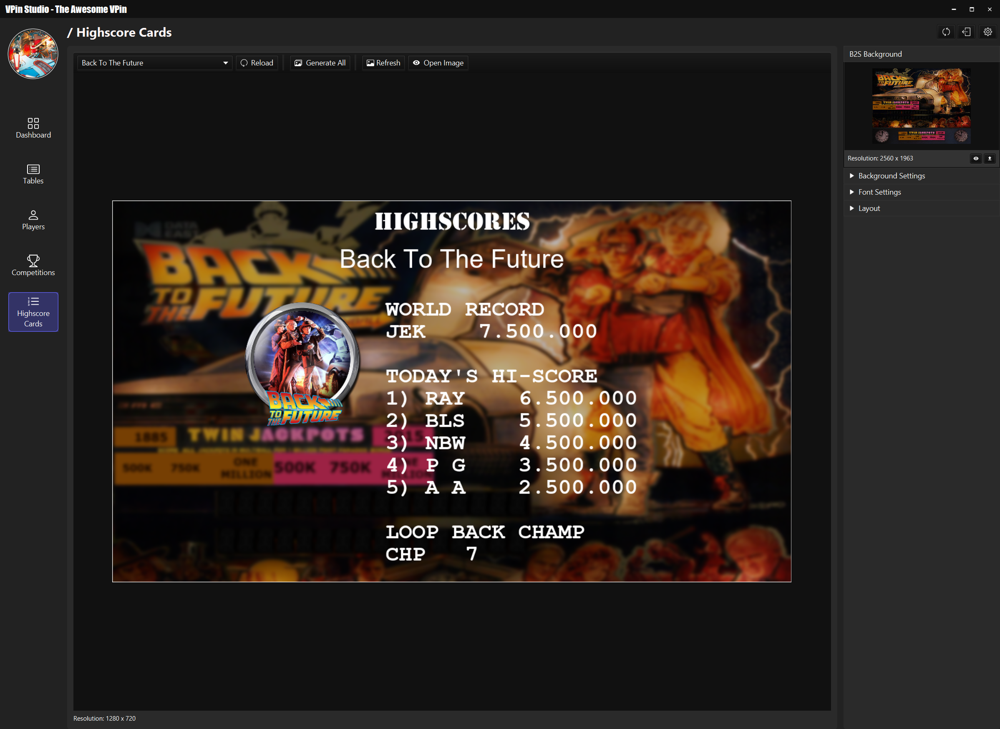

# VPin Studio

The VPin Studio is a util to manage VPin users and competitions.
It depends on PinUP Popper and gives the user an overview about installed tables
and their media configuration.

The given overview shows the key features and roadmap of the VPin Studio
In general, the VPin Studio has a client/server architecture, 
supporting the configuration of multiple VPin with one client

### Key Features

- _TBA: to-be-announced (development not started yet)_ 
- _WIP: work-in-progress (development has been started)_

#### Highscores
  - extraction and versioning of different highscores
  - highscore card generator (including style editing)

#### Table Management
  - table media validation
  - table ROM validation
  - POV export
  - POV editing
  - table script preview
  - table volume control
  - table upload
  - rom upload
  - directb2s upload
  - VPA export/import (_VPA = visual pinball archive_ - contains all related file for a table (music, vpx file, rom, nvram, directb2s, popper metadata, ...)) (_WIP_)
  - "alt-sound" editor (_TBA_) (not sure about this yet, but it would be nice to have an actual UI instead of cumbersome CSV editing)

#### User Management
  - build in user management
  - Discord user management

#### Discord Integration
  - Discord channel to VPin mapping (1:1 connection) (when a group of people using 1x VPin for competitions)
  - Discord channel to VPin**s** mapping (n:1 connection) (when VPin owners want to compete against each other) (_TBA_)
  - Discord user name to highscore mapping
  - Webhook support for publishing new highscores and competitions events
  - BOT support:
    - request table highscore
    - request player rank
    - request player rankings
    - request active competition
    - 
#### Competition Management
 - Offline Competitions (these are used for when multiple people using one VPin)
 - Online Competitions (_TBA_, these will work together with the n:1 Discord support)

#### Dashboard Support
 - "Recent Scores Widget": shows the latest n highscores that have been created with player name info
 - "Active Competition Widget": shows the status of the active competition including a highscore graph
 - "Player Ranking Widget": shows a leader board of all players

#### Highscore Card Generation
  - updates highscore cards on table-exit with the latest highscore
  - editor support for styling highscore cards
  - directb2s background image support

#### Miscellaneous
- Automatic shutdown support for VPins
- PinUP Popper reset support

### Screenshots

__Table Media Overview__

__Table Validation__

__Table Highscore Overview__

__Table POV Extraction & Editing__

__Table Volume Control__

__Dashboard__

__Discord Players__

__Highscore Card Editor__

__BOT Support (Example Chat)__

__VPin Overlay__

(this is what you will see on your VPin when the overlay key is mapped)

### Documentation

wip

### Resources

##### Third Party Licenses:

see documentation folder

Icons:

<a href="https://www.flaticon.com/free-icons/trophy" title="trophy icons">Trophy icons created by Freepik - Flaticon</a>
<a href="https://www.flaticon.com/free-icons/medal" title="medal icons">Medal icons created by Freepik - Flaticon</a>

Fonts: https://www.1001fonts.com/digital-7-font.html#license