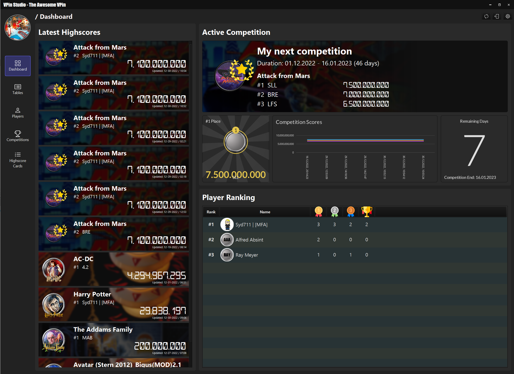
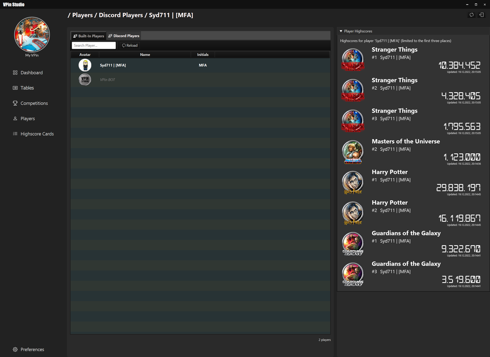

# VPin Studio

The VPin Studio is a util to manage VPin users and competitions.
It depends on PinUP Popper and gives the user an overview about installed tables
and their media configuration.

### Key Features

- Storing and versioning of VPin highscores (depending on pinemhi)
- Table media validation
- Table assets validation
- Build-in user managment
- Discord integration:
  - user name to highscore mapping
  - Webhook support for publishing new highscores and competitions
  - BOT support to ask for highscores and player ranks
- Competition management
- VPin dashboard support
- Highscore card generation
- Automatic shutdown support for VPins
- PinUP Popper reset support

### Screenshots

__Table Management__

__Dashboard__

__Discord Players__

### Documentation

wip

### Resources

##### Third Party Licenses:

see documentation folder

Icons:

<a href="https://www.flaticon.com/free-icons/trophy" title="trophy icons">Trophy icons created by Freepik - Flaticon</a>
<a href="https://www.flaticon.com/free-icons/medal" title="medal icons">Medal icons created by Freepik - Flaticon</a>

Fonts:
https://www.1001fonts.com/digital-7-font.html#license