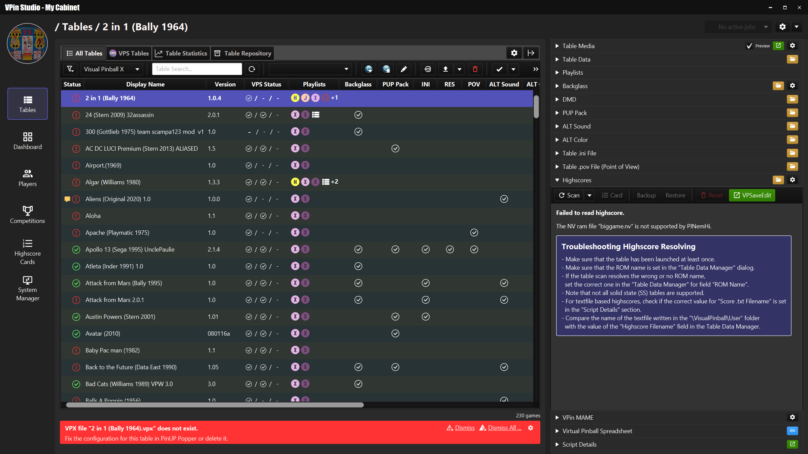
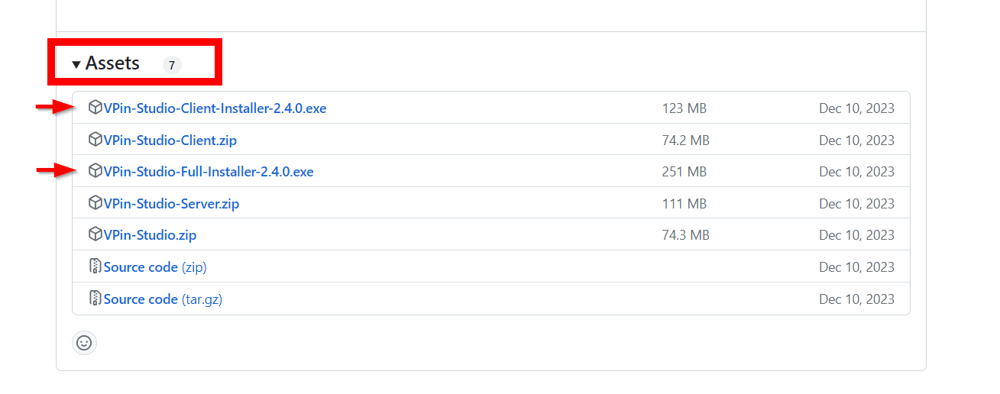
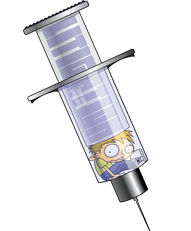

# VPin Studio

The VPin Studio is a util to manage VPin users, tables, competitions and highscores.
It depends on PinUP Popper and gives the user an overview about installed tables
and their media configuration.

## Download

Download the latest installer from the [releases section](https://github.com/syd711/vpin-studio/releases).
Scroll down to the "Assets" section, expand it and download the "Full Installer" for the initial installation on your cabinet.
Download the "Client Installer" if you wish to connect to your cabinet (running the VPin Studio Server) with another Windows PC.

In general, the VPin Studio has a client/server architecture,
supporting the configuration of multiple VPins with one client.
That's why every release comes with two different installers:
- **Full Installer**: this installer must always be installed on the actual VPin and contains the server and the client UI.
- **Client Installer**: this installer only contains the UI client which let's you connect from any other Windows PC to your VPin.

## Getting Started

Please see:

https://github.com/syd711/vpin-studio/wiki#getting-started

## Discord

You have feedback or want to report a bug? Join the VPin Studio Discord server:
[https://discord.com/invite/69YqHYd3wD](https://discord.gg/AMPwvAZHvy)

## How To Update

Please see: 

https://github.com/syd711/vpin-studio/wiki#updates

## Documentation

A full documentation is available in the wiki of this repository:

https://github.com/syd711/vpin-studio/wiki

## YouTube

https://www.youtube.com/@vpin-studio/videos

## Donate 

Creating and maintaing the VPin Studio takes a lot of time and resources. Please consider donating through ko-fi.com to support the development.

## Third Party Integrations

### PinUP Virtual Pinball System

https://www.nailbuster.com/wikipinup/doku.php?id=start

 

### Visual Pinball Backup Manager

 

Download: https://github.com/mmattner/vPinBackupManagerApp/releases

Documentation: https://github.com/mmattner/vPinBackupManagerApp/wiki 

### PINemHi and PINemHi Leaderboard

 

Download: http://www.pinemhi.com/

Documentation: http://www.pinemhi.com/

### PinVol

Download: http://mjrnet.org/pinscape/PinVol.html

Documentation: http://mjrnet.org/pinscape/PinVol.html

## Third Party Licenses and Resources

For license texts have a look at [Third-Party Libraries](./documentation/third-party-licenses/)

### Icons
<a href="https://www.flaticon.com/free-icons/trophy" title="trophy icons">Trophy icons created by Freepik - Flaticon</a> 
<a href="https://www.flaticon.com/free-icons/medal" title="medal icons">Medal icons created by Freepik - Flaticon</a> 

### Fonts
Fonts: https://www.1001fonts.com/digital-7-font.html#license

### 7zip
https://7-zip.org/

### ffmpeg 
https://ffmpeg.org/ffmpeg.html

### nircmd
https://www.nirsoft.net/utils/nircmd.html

### PupPackScreenTweaker
https://github.com/matiou11/PupPackScreenTweaker

### Sounds 
Sound Effect by <a href="https://pixabay.com/users/edr-1177074/?utm_source=link-attribution&amp;utm_medium=referral&amp;utm_campaign=music&amp;utm_content=8325">EdR</a> from <a href="https://pixabay.com//?utm_source=link-attribution&amp;utm_medium=referral&amp;utm_campaign=music&amp;utm_content=8325">Pixabay</a>

Sound Effect from <a href="https://pixabay.com/sound-effects/?utm_source=link-attribution&amp;utm_medium=referral&amp;utm_campaign=music&amp;utm_content=92097">Pixabay</a>

### JavaFX Icon Sets
https://kordamp.org/ikonli/cheat-sheet-materialdesign2.html#_s_materialdesigns

https://kordamp.org/ikonli/cheat-sheet-bootstrapicons.html

https://kordamp.org/ikonli/cheat-sheet-simplelineicons.html

## Custom Icons 
Pinball Flippers by [Angelo Troiano](https://thenounproject.com/creator/angelo.troiano28) under Creative Commons 3.0 license.  

Scifi Starwars Darth from [Libre Icons](https://github.com/DennisSuitters/LibreICONS) by Dennis Suitters.  

Soccer Ball and Clapper Board from [Microsoft Fluent UI Emoji Set](https://github.com/microsoft/fluentui-emoji)

Music icon from IcoMoon - Free Pack by [IcoMoon](https://icomoon.io/)

VPW icon created from [Virtual Pinball Workshop](https://www.vpinworkshop.com) logo.

Pinball FX, Pinball FX3, and Pinball M icons created from Zen Studios [Pinball FX](https://www.pinballfx.com), [Pinball FX3](https://zenstudios.com/games/pinball-fx3/), and [Pinball M](https://zenstudios.com/games/pinball-m/) logos.

Visual Pinball X icon created from [Visual Pinball](https://github.com/vpinball/vpinball) logo. 

SuperHero icon from [Strong icons](https://www.flaticon.com/free-icons/strong) created by Leremy 

VR icon from [IcoNoir](https://iconoir.com).
