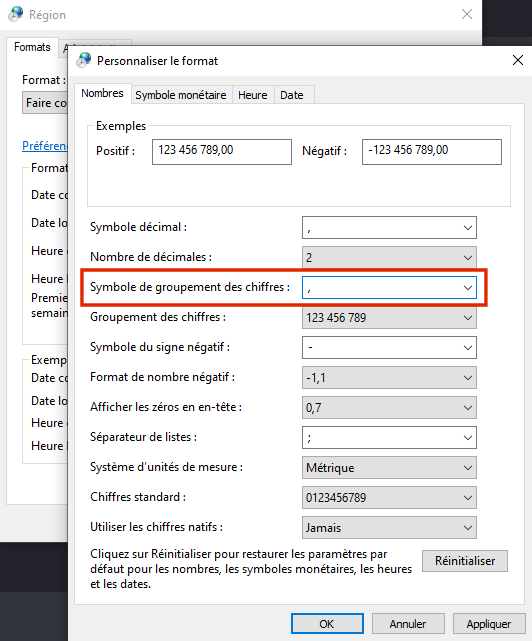

# Documentation

The given documentation gives a brief summary about the most important features of the VPin Studio.
Be aware that the given screenshots might not match with the latest release.

* [Dashboard](#dashboard)
* [Tables](#tables)
* [Player](#players)
* [Competitions](#competitions)
* [Highscore Cards](#highscore-cards)]
* [Trouble Shooting / FAQ](#trouble-shooting)

## Dashboard

The dashboard gives you a brief summary about the "status" of your VPin.
It includes the active competitions, player ranking and and latest scores.
The dashboard layout shown on startup of the Studio does not match with the one
shown as overlay.

 
_The VPin Studio Dashboard_ 

The actual overlay is shown on the VPin startup or when the overlay key (mapped in the preferences) was pressed:

 
_The VPin Overlay_ 

## Tables

## Players

## Competitions

## Highscore Cards

## Trouble Shooting

### FAQ

### I got encoding problems on my highscore cards!

Users have reported whitespace problems for their generated highscore cards.
You can fix this by settings a comma as number separator in your windows settings.
See also: https://forums.gameex.com/forums/topic/26335-scores-files-text-from-pinemhi-contains-strange-characters-as-thousands-separator/

### I want to use directb2s backgrounds, but my files are located in another folder!

By default, the service assumes that these files are located in the __Tables__ folder
of Visual Pinball. If you only want to use the files for the background of your highscore cards,
check the __resources/env.properties__ file and change the path there.
Note that you have to restart the service/UI to apply the change.

